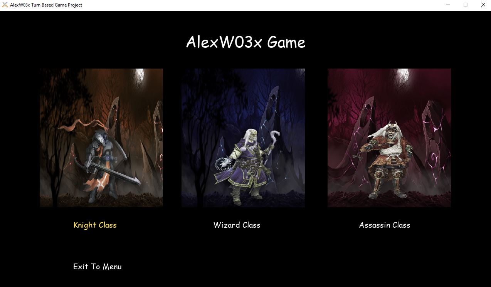

# Python Turn Based Game 
## What is it?
> It is a game that takes turns with you and the computer to create a 1v1 situation where whoever plays their abilities better will win the match. It is inspired by a game I used to play when I was younger called Sonny and I tried to use all the python knowledge that I learnt to build this with no help and due to time limitations and needing to shift focus onto other assignments and projects I had to leave this project unfinished and it has some small bugs.

## Python Requirements
PyGame
```
pip install pygame
```

## What am I proud of when I coded this?
> I was able to create a game that utilises save data and loads data successfully without any errors where this expanded my ability to add more features such as skills, custom skill selection, attributes modification, custom characters, different game levels that all stores into one file to ensure that no save data is lost and I am extremely happy with how I was able to create a hot swappable skill system with all 27 skills in the game working with one another and has their own effects and cooldowns too.

## Graphics Notice
> I did not design any graphics or assets for this game all graphics were found on google images, and soundboard websites.

## Bugs
```
XP modifier needs to reach the end of its levelling up cycle in order to save stats
XP visuals for the modifier may go past 100% unintentionally when XP gains are large
Skill issue: Strength bonuses applied from skills may be bugged (rare)
Tutorial Level exit icon may take players to the camp if they havent completed the tutorial yet, this shouldn't happen.
Skills can be added as many times as you want (no prevention code)
Level progression can be bugged and require you to complete the same level again.
Skill 4 doesn't unlock upon first level up and instead skill 5 does, shouldn't happen.
```

## Screenshots





